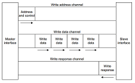
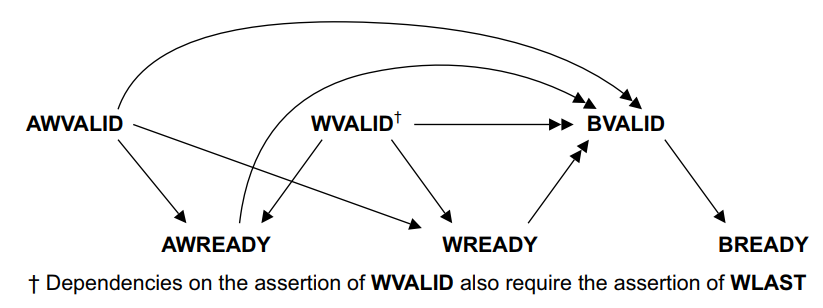

# axi_lite_controller_v2.0

## 写在前面

这是一个用户定义的 verilog IP core ，用于通过 slave 的 AXI4_Lite 进行 FPGA 传输。

对 v1.0 版本的功能进行扩充，更符合官方手册提供的时序。

[这是代码](axi_lite_controller_v2.0.v)。
这边建议先阅读理论知识和 v1.0 版本代码再来看本篇内容，效果更佳。

## 写数据依赖

我们先来看下写数据所用的通道。



在下面的依赖图中：
* 单头箭头指向的信号可以在始端信号有效前或有效后有效`（前后没有依赖关系）`。
* 双头箭头指向的信号只有在始端信号有效后才能有效`（具备前提条件）`。

**写数据时序依赖**。



- 关于**写地址**的握手信号 `AWVALID` 和 `AWREADY` 之间没有依赖关系；
- 关于**写数据**的握手信号 `WVALID` 和 `WREADY` 之间没有依赖关系；
- **写地址**和**写数据**之间没有依赖关系；
- **写回复**需要在数据写入寄存器之后，再进行 `BVALID` 的拉高。

## 写地址

为了节省总线占用，我们仅当 `AWVALID` 为高时，置高 `AWREADY`。

```
    always @(posedge aclk or negedge aresetn) begin
        if (~aresetn) saxi_awready <= 1'b0;
        else begin
            if (saxi_awvalid) saxi_awready <= 1'b1;
            else saxi_awready <= 1'b0;
        end
    end
```

当 `AWVALID` 和 `AWREADY` 均为高时，将 `写地址` 存放至 `buffer` 中。
```
    // saxi_awaddr -> saxi_awaddr_buffer
    reg [AXI_ADDERSS_WIDTH-1 : 0]  saxi_awaddr_buffer;
    always @(posedge aclk or negedge aresetn) begin
        if (~aresetn) saxi_awaddr_buffer <= 'b0;
        else begin
            if (saxi_awvalid & saxi_awready) saxi_awaddr_buffer <= saxi_awaddr;
            else saxi_awaddr_buffer <= saxi_awaddr_buffer;
        end
    end
```

## 写数据

为了节省总线占用，我们仅当 `WVALID` 为高时，置高 `WREADY`。

```
    always @(posedge aclk or negedge aresetn) begin
        if (~aresetn) saxi_wready <= 1'b0;
        else begin
            if (saxi_wvalid) saxi_wready <= 1'b1;
            else saxi_wready <= 1'b0;
        end
    end
```

将数据写入寄存器中需要两个东西，一者是数据（我们现在有了），二者是现在真实的写地址。
接下来我们需要确定我们**真实的写地址** `axi_waddr`。

**注意**：我们这边的写操作时序仅做到两个功能
- 地址与数据同时到
- 地址先到，数据后到（将先到的地址存入 `saxi_awaddr_buffer` 中）
- **（未实现）**，数据先于地址

```
    // real address to write
    // data    -> address -> write or
    // address -> data    -> write
    reg [AXI_ADDERSS_WIDTH-1 : 0]  axi_waddr;
    always @(*) begin
        if (saxi_awvalid & saxi_awready & saxi_wvalid & saxi_wready) axi_waddr <= saxi_awaddr;
        else axi_waddr <= saxi_awaddr_buffer;
    end
    
    // data -> register
    always @(posedge aclk or negedge aresetn) begin
        if (~aresetn) begin
            reg1_reg <= 'b0;
            reg2_reg <= 'b0;
        end
        else begin
            case (axi_waddr)
                'h00: reg1_reg <= saxi_wdata;
                'h04: reg2_reg <= saxi_wdata;
                default: begin
                    reg1_reg <= reg1_reg;
                    reg2_reg <= reg2_reg;
                end
            endcase
        end
    end
```


## 写回复

写回复这边，博主添加了 `axi_need_resp` 标志信号。

```
    reg axi_need_resp;
    always @(posedge aclk or negedge aresetn) begin
        if (~aresetn) axi_need_resp <= 1'b0;
        else begin
            if (saxi_wvalid & saxi_wready) axi_need_resp <= 1'b1;
            else axi_need_resp <= 1'b0;
        end
    end

    // output
    always @(posedge aclk or negedge aresetn) begin
        if (~aresetn) saxi_bvalid <= 1'b0;
        else begin
            if (axi_need_resp) saxi_bvalid <= 1'b1;
            if (saxi_bvalid & saxi_bready) saxi_bvalid <= 1'b0;
        end
    end
```

## 关于读操作

读操作稍微简单一些，相比于 v1.0 主要添加了 `axi_need_read` 标志信号、
`axi_wait_for_read` 标志信号、`axi_raddr` 读地址寄存器、`axi_data_to_read` 读数据寄存器。

接收到读地址。
```
    // axi_raddr -> saxi_araddr
    reg [AXI_ADDERSS_WIDTH-1 : 0]  axi_raddr;
    reg axi_need_read;
    always @(posedge aclk or negedge aresetn) begin
        if (~aresetn) begin
            axi_raddr     <= 'b0;
            axi_need_read <= 1'b0;
        end
        else begin
            if (saxi_arvalid & saxi_arready) begin
                axi_raddr     <= saxi_araddr;
                axi_need_read <= 1'b1;
            end
            else begin
                axi_raddr     <= axi_raddr;
                axi_need_read <= 1'b0;
            end
        end
    end
```

根据读地址寄存器 `axi_raddr` 读取对应数据，存放至 `axi_data_to_read`。
```
    // data register -> axi_data_to_read
    reg [AXI_DATA_WIDTH-1 : 0] axi_data_to_read; //data_temp
    always @(*) begin
        case (axi_raddr)
            'h00: axi_data_to_read <= reg1_reg;
            'h04: axi_data_to_read <= reg2_reg;
            default: axi_data_to_read <= 'b0;
        endcase
    end
```

根据时序，将 `axi_data_to_read` 输出。
```
    // axi_data_to_read -> output
    reg axi_wait_for_read;
    always @(posedge aclk or negedge aresetn) begin
        if (~aresetn) begin
            saxi_rvalid       <= 1'b0;
            saxi_rdata        <= 'b0;
            axi_wait_for_read <= 1'b0;
        end
        else begin
            if (axi_wait_for_read) begin
                if (saxi_rready) begin
                    // address first
                    // wait for host receive
                    axi_wait_for_read <= 1'b0;
                    saxi_rdata        <= axi_data_to_read;
                    saxi_rvalid       <= 1'b1;
                end
                else axi_wait_for_read <= axi_wait_for_read;
            end
            else begin
                if (axi_need_read & saxi_rready) begin
                    // address and receive together
                    saxi_rdata  <= axi_data_to_read;
                    saxi_rvalid <= 1'b1;
                end
                else if (axi_need_read) begin
                    // address first, host no receive
                    axi_wait_for_read <= 1'b1;
                    saxi_rvalid       <= 1'b0;
                end
                else saxi_rvalid      <= 1'b0;
            end
        end
    end
```
