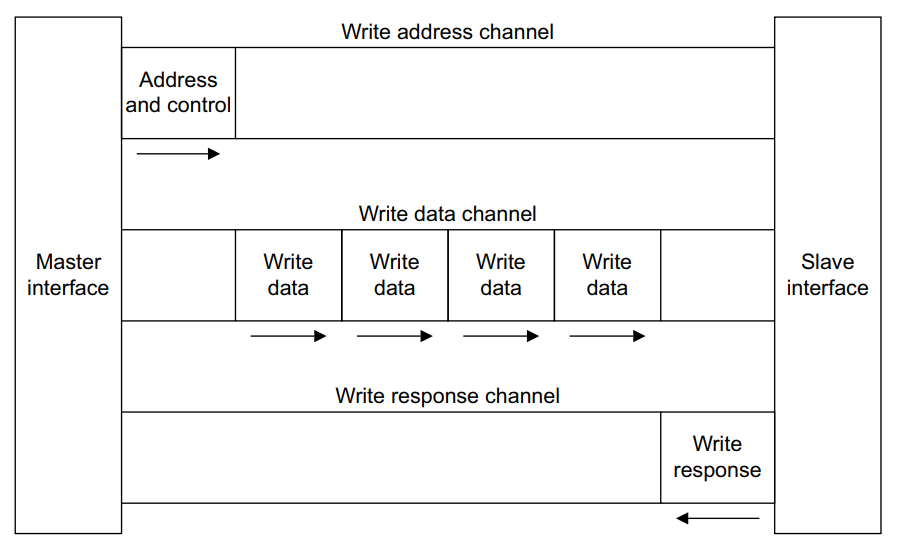

# axi_lite_controller_v2.0

## 写在前面

这是一个用户定义的 verilog IP core ，用于通过 slave 的 AXI4_Lite 进行 FPGA 传输。

对 v1.0 版本的功能进行扩充，更符合官方手册提供的时序。

[这是代码](axi_lite_controller_v2.0.v)。
这边建议先阅读理论知识和 v1.0 版本代码再来看本篇内容，效果更佳。

**主要改进了**

## 写数据

我们先来看下写数据所用的通道。

写地址时序依赖。

写数据时序依赖。

